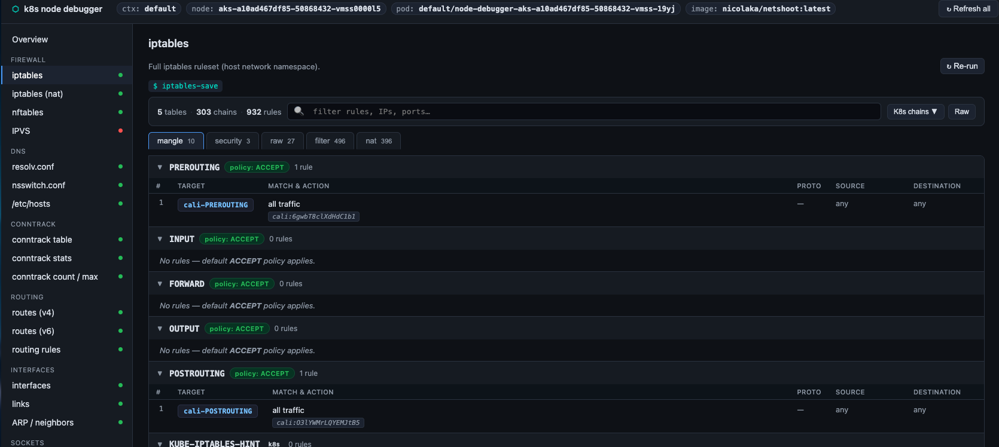
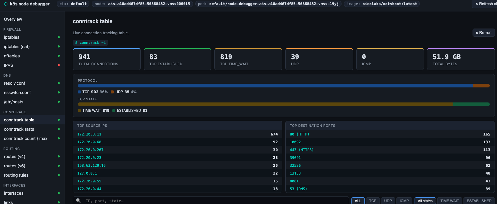

# k8s node debugger

Spin up a privileged debug pod on any Kubernetes node and inspect its full network stack from a browser — no SSH required.

One command creates the pod, opens the browser, and cleans up when you're done.

```bash
node bin/k8s-node-debugger.js <node-name>
```

## Screenshots

### iptables — interactive rule viewer



### conntrack — live connection tracking



## Install

```bash
git clone git@github.com:goutamtadi1/k8s-node-debugger.git
cd k8s-node-debugger
npm install
```

Requires `kubectl` on your PATH with an active kubeconfig. The debug image (`nicolaka/netshoot`) is pulled from Docker Hub on first use.

## Usage

```bash
# list nodes in the current context
node bin/k8s-node-debugger.js --list

# debug a specific node (opens http://localhost:7878)
node bin/k8s-node-debugger.js <node-name>

# options
node bin/k8s-node-debugger.js <node-name> \
  --namespace kube-system \   # namespace for the debug pod (default: default)
  --context my-ctx \          # kubeconfig context (default: current)
  --port 9000 \               # UI port (default: 7878)
  --keep \                    # leave the pod running after exit
  --no-open                   # don't auto-open the browser
```

Press **Ctrl-C** to stop the server and delete the debug pod.

## What it shows

| Section | Probes |
|---|---|
| **Firewall** | iptables (all tables), iptables nat, nftables, IPVS |
| **DNS** | resolv.conf, nsswitch.conf, /etc/hosts |
| **Conntrack** | connection table, per-CPU stats, count/max gauge |
| **Routing** | IPv4 routes, IPv6 routes, policy rules |
| **Interfaces** | ip addr, ip link stats, ARP/neighbors |
| **Sockets** | listening sockets, all TCP/UDP with process names |
| **Kernel** | key net.* sysctls |
| **Terminal** | streaming terminal — run any command inside the pod (tcpdump, dig, ping, conntrack -E …) |

### iptables view features

- Tabs per table (mangle · security · raw · filter · nat) with rule counts
- Collapsible chain cards with default-policy badge and packet/byte counters
- Colour-coded target badges: ACCEPT / DROP / REJECT / MASQUERADE / DNAT / LOG / MARK / k8s chain / …
- Human-readable rule summaries with port service names (SSH, HTTPS, etcd, kubelet, k8s-API, NodePort range …)
- Live search across all tables and chains
- KUBE-SVC-\* / KUBE-SEP-\* chains collapsed by default; toggle with **K8s chains** button
- Click any rule to reveal the raw `iptables-save` line
- **Raw** toggle to fall back to plain text

### conntrack view features

- Stat cards: Total · TCP ESTABLISHED · TCP TIME\_WAIT · UDP · ICMP · total bytes
- Protocol distribution bar and TCP state breakdown bar
- Top 8 source IPs and top 8 destination ports (with service names)
- Filter by protocol and TCP state; full-text search by IP, port, or state
- Connection rows show state badge, ASSURED/UNREPLIED flag, src:port → dst:port, TTL, bytes, and a NAT tag when the reply source differs from the original destination
- Paginated 200 at a time
- Per-CPU stats table with drops/errors highlighted in red
- Count/max capacity gauge (green → amber → red at 50% / 80%)

## How it works

The debug pod (`nicolaka/netshoot`) is created with:

- `hostNetwork: true` — shares the node's network namespace
- `hostPID: true` — allows `nsenter` to enter the host mount namespace
- `privileged: true` — required for iptables / conntrack / tcpdump
- Host root mounted at `/host` — for reading node files
- Tolerations for all taints — schedules onto control-plane nodes too

The server shells out to your local `kubectl`, so your active kubeconfig, current context, and any exec auth plugins (EKS, GKE, AKS) are reused automatically.

## Environment variables

| Variable | Default | Description |
|---|---|---|
| `KUBECTL_BIN` | `kubectl` | Path to the kubectl binary |
| `DEBUGGER_IMAGE` | `nicolaka/netshoot:latest` | Debug container image |
